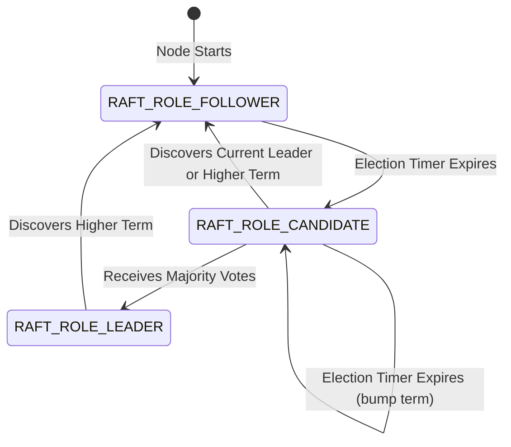
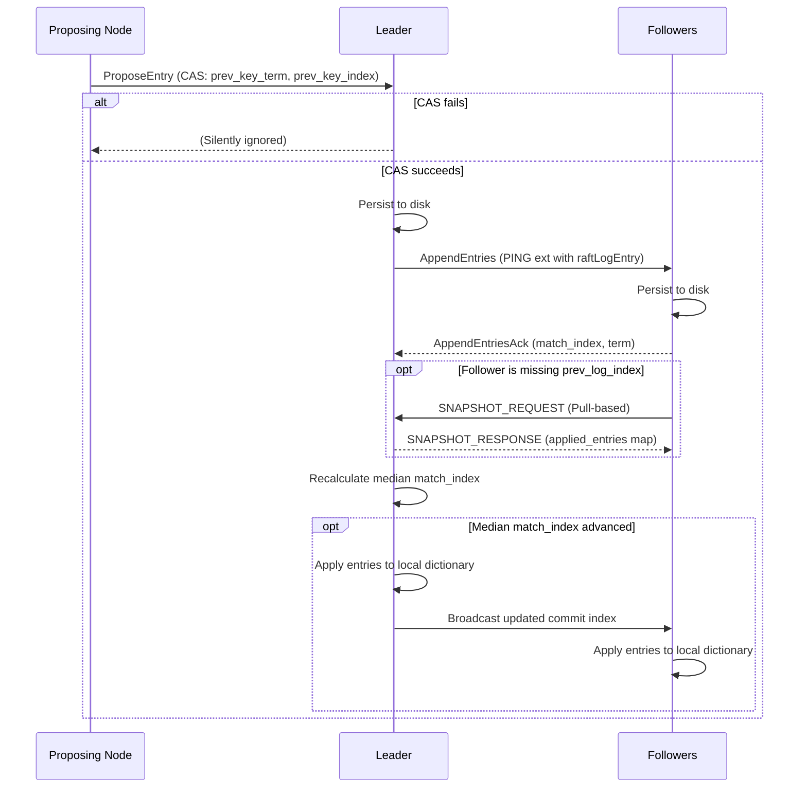
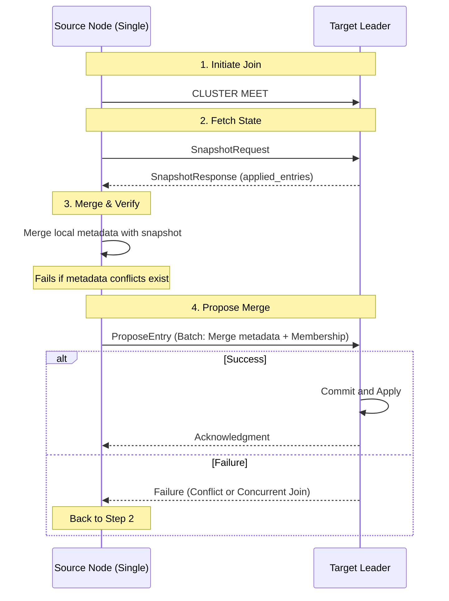

# Cluster Raft

## High-level overview

Valkey Cluster traditionally uses a
[gossip protocol](https://en.wikipedia.org/wiki/Gossip_protocol) to maintain
metadata like node roles and membership. This peer-to-peer system spreads
information quickly but cannot guarantee
[strong consistency](https://en.wikipedia.org/wiki/Strong_consistency) or
[durability](https://en.wikipedia.org/wiki/ACID#Durability). We refer to this
mode as Cluster Gossip mode or Cluster Legacy mode.

Cluster Raft is a new mode of operation for Valkey Cluster that uses
[Raft](https://raft.github.io/) to manage cluster metadata. It is mutually
exclusive with Cluster Gossip mode.

Cluster Raft is configured at boot time only. Each node is marked as
`cluster-raft-enabled = yes` locally. When enabled, each node boots into its own
local, single-member Raft group. Cluster metadata changes on
`cluster-raft-enabled` nodes are fully managed by its Raft group.

Raft groups join together during `CLUSTER MEET`. To support the Raft group
bootstrap, constraints are added to `CLUSTER MEET` when `cluster-raft-enabled`
is set:

- `CLUSTER MEET` can only be executed on single-member Raft groups, otherwise
  `CLUSTER MEET` will fail.
- `CLUSTER MEET` can only be executed to join nodes that have matching
  `cluster-raft-enabled` settings.
- `CLUSTER MEET` can only be executed to join Raft groups with disjoint
  metadata.

These constraints will require new provisioning logic for many Valkey Cluster
admins, but are needed to ensure safe and simple Raft group bootstrapping.

## User Configurations

| Configuration          | Description                                                                                                    |
| ---------------------- | -------------------------------------------------------------------------------------------------------------- |
| `cluster-raft-enabled` | Whether Cluster Raft is enabled for the node. Configured at boot time only. Defaults to `no` (Cluster Gossip). |

## Transport Protocol

Cluster Raft messages are sent over the cluster bus using the
`CLUSTERMSG_TYPE_RAFT_*` message types:

- `CLUSTERMSG_TYPE_RAFT_VOTE_REQUEST`: Request for votes.
- `CLUSTERMSG_TYPE_RAFT_VOTE_RESPONSE`: Response to vote requests.
- `CLUSTERMSG_TYPE_RAFT_APPEND_ENTRIES`: Append entries to the log.
- `CLUSTERMSG_TYPE_RAFT_APPEND_ENTRIES_ACK`: Acknowledgment of appended entries.
- `CLUSTERMSG_TYPE_RAFT_SNAPSHOT_REQUEST`: A node explicitly pulling the
  committed state (a snapshot) from a peer.
- `CLUSTERMSG_TYPE_RAFT_SNAPSHOT_RESPONSE`: A peer responding with its committed
  snapshot.

Additionally, to allow decoupling non-voting members from the Raft primary,
Valkey cluster nodes embed their `raft_commit_index` and `raft_term` into the
extensions of all standard `PING`/`PONG` gossip packets. This enables all nodes
to passively and cheaply discover the latest committed state globally.

For details on what contents are included in each message, see
`src/cluster_raft.h`.

## Node-level flags

To manage construction and discovery of the Raft group, Valkey nodes gossip up
to three flags:

- **CLUSTER_NODE_RAFT_ENABLED**: Explicitly set by the user via the
  `cluster-raft-enabled` configuration option (`yes`/`no`). Indicates the node
  is operating in Cluster Raft mode.
- **CLUSTER_NODE_RAFT_LEADER**: Implicitly set by the Raft group leader.
  Indicates the node is the leader of the Raft group.

## Roles and Elections

Cluster Raft incorporates the three standard roles: `RAFT_ROLE_FOLLOWER`,
`RAFT_ROLE_CANDIDATE`, and `RAFT_ROLE_LEADER`.

`cluster-raft-enabled` nodes will go through the following state machine:



- **Election Timer:** Nodes transition to candidates and increment their term if
  they do not receive a heartbeat or `AppendEntries` message within the
  `RAFT_ELECTION_TIMEOUT`.
- **Heartbeat Timer:** The leader periodically broadcasts an `AppendEntries`
  message to all members to maintain authority.
- **Vote Requests:** Candidates request votes natively through the cluster bus
  (`CLUSTERMSG_TYPE_RAFT_VOTE_REQUEST`). Responses are collected to determine a
  majority.

## Metadata Changes and Replication

Metadata is stored in a flat key-value store. This allows for easy addition of
new metadata fields without modifying the Raft state machine.

The Raft state consists of `pending_entries` and `applied_entries`:

- `pending_entries`: A list of log entries that have not been applied. This is
  our "staging" area. Entries may be rolled back on leader change.
- `applied_entries`: A map from key to log entry. This reflects the latest
  applied state of all metadata on the local node. As changes are applied, they
  are merged into the map.

Additionally, to know when `pending_entries` are committed, each node has a
`match_index` field that tracks the highest index of the last entry that node
has successfully persisted. The leader tracks the `match_index` of all followers
and commits an entry once a majority of followers have persisted it.

**Important:** The Raft log is automatically compacted into the
`applied_entries` map as entries are applied. This means that the Raft log will
only ever contain the entries that have not yet been applied. This
simplification avoids the need for manual log compaction at the cost of
[lagging followers](#lagging-followers) requiring full
[snapshots](#snapshotting).

### Sequence Diagram

The process for committing metadata changes is as follows:



### Proposals

Nodes submit proposals utilizing an optimistic Compare-And-Swap (CAS) via
`prev_key_term` and `prev_key_index` fields.

CAS verifies that the latest pending or applied state matches the proposals
previously observed state. This means only one proposal can be pending per key
at a time. Proposals that fail the CAS check are rejected. Nodes are expected to
discover the proposal conflict once the in-flight change is committed, or to
retry the commit periodically.

For example:

1. At commit index 1 and term 1, key `foo` has value `bar`.
2. Node A proposes a change to key `foo` with value `baz`, with `prev_key_term`
   set to 1 and `prev_key_index` set to 1.
3. Node B proposes a change to key `foo` with value `qux`, with `prev_key_term`
   set to 1 and `prev_key_index` set to 1.
4. The leader sees Node A's proposal first and adds it to its pending entries.
5. The leader sees Node B's proposal and rejects it because the latest pending
   or applied state does not match the proposals previously observed state
   (`prev_key_index 1, prev_key_term 1` != `pending_index 2, pending_term 1`).
6. The leader follows the [Replication Flow](#replication-flow) to commit Node
   A's proposal.
7. Node B eventually discovers the new commit index/term (2, 1). After applying
   the state locally, it determines whether to:
   - Retry the proposal with the new `prev_key_index` (2) and `prev_key_term`
     (1).
   - Abandon the proposal if the new state conflicts with its own goals (e.g.
     failover).

**Batched Proposals**: Proposals can also be batched together to reduce overhead
or ensure atomicity of related changes. For example, when becoming a replica, a
node may propose to delete its old shard while adding itself as a member of
another shard in one operation. For atomicity, batched commits are committed and
replicated as a single appended entry with a single index and term.

Therefore, a ProposeEntry message consists of:

1. The current term of the node proposing the change
2. A list of CAS pairs (key name, previous index, previous term).
3. A list of mutations (key name, new value).

### AppendEntries

The leader replicates metadata changes to followers by attaching `AppendEntries`
data to standard cluster `PING`/`PONG` messages.

The leader sends these messages in two scenarios:

1.  **Immediately** when a node proposes new metadata.
2.  **Periodically** as heartbeats to maintain leadership authority and catch up
    lagging followers.

An `AppendEntries` message consists of:

1. The current term of the leader
2. The name of the current Raft leader.
3. The index of the previous log entry.
4. The term of the previous log entry.
5. The index of the last committed value.
6. A list of new `Entry`s

Each `Entry` message consists of:

1. The index of the entry
2. The term of the entry
3. A list of mutations (key name, new value).

#### Replication Flow

`AppendEntries` are used for log replication and persistence on a quourm of
followers:

1.  The leader sends new log entries to followers. Each message includes
    references to the last entry the follower acknowledged, allowing the
    follower to verify its history is continuous.
2.  When a follower successfully saves the entry to disk, it responds with an
    acknowledgment (`AppendEntriesAck`).
3.  The leader tracks acknowledges from all followers. Once a **majority
    (quorum)** of followers have saved the entry:
    - The leader applies the change to its local state. It compacts the entry
      into the `applied_entries` map.
    - The leader updates its `commit_index` (the pointer to the latest finalized
      entry).
4.  The leader broadcasts the updated `commit_index`. Other nodes then apply the
    committed changes to their own local state.

#### Lagging Followers

If a follower falls too far behind, the leader cannot catch it up using standard
messages because the leader compacts old log entries into the `applied_entries`
map to save space.

Leaders detect lagging followers when they fail to respond to `AppendEntries`
messages and their `match_index` becomes less than the leader's oldest entry in
`pending_entries`. When this happens, leaders don't stop sending `AppendEntries`
messages, but the leader's reference to the previous log entry will silently
advance beyond the lagging follower's `match_index`.

A follower detects the lag when it receives messages referencing a previous
entry it hasn't seen. In this case, the follower must
[fetch a snapshot](#snapshotting), a full copy of the committed state, from an
up-to-date peer to get back in sync.

### Snapshotting

Snapshotting allows a lagging followers to catch up to the latest committed
state.

All raft nodes will accept `CLUSTER_RAFT_SNAPSHOT_REQUEST` messages. When such a
message is received, that node will reply with a
`CLUSTER_RAFT_SNAPSHOT_RESPONSE` message containing its latest `applied_entries`
map and the current committed index and term. The requesting node will then
apply the snapshot locally.

## On-Disk Log Format

To make the metadata changes durable, we require a new on-disk log format.

We separate `pending_entries` and `applied_entries` into two files. The
`pending_entries` file is an append-only log, while the `applied_entries` file
is a map from key to log entry. The `pending_entries` file can be appended to
safely without updating the snapshot in `applied_entries`.

When a new entry is added to `pending_entries` on the leader or a follower, we
persist the new entry to disk. It is not needed for `applied_entries` updates.
An entry in `pending_entries` will be guaranteed to be reapplied as long as a
majority of Raft members have persisted it.

### Applied Entries On-Disk Format

By default, applied entries would be stored in `raft_applied.base`. The file is
stored in the following binary format:

```
<magic> <version> <applied_entries_opcode> <applied_entries_size> <applied_entry_1> ... <applied_entry_n>
```

Each applied entry would follow the format:

```
<index> <term> <key> <value>
```

### Pending Entries On-Disk Format

By default, pending entries would be stored in `raft_pending.incr`. The file is
stored in the following binary format:

```
<magic> <version> <pending_entry_opcode> <pending_entry_1> ... <pending_entry_opcode> <pending_entry_n>
```

Each pending entry would follow the format:

```
<index> <term> <mutation_count> <key_1> <value_1> ... <key_n> <value_n>
```

## Raft Group Formation

Each node with `cluster-raft-enabled = yes` boots into its own local,
single-member Raft group. The node is its own leader, and the group consists
solely of that node.

Multiple single-member groups join together to form larger groups using the
`CLUSTER MEET` mechanism.

Metadata changes (e.g. slot assignments, role assignments, etc.) can be made on
single-member groups. However collisions will not be handled in `CLUSTER MEET`.
Operators must ensure no conflicting metadata changes are made on different
single-member groups.

### Membership Changes

`cluster-raft-enabled` are joined to the Raft group by an operator using
`CLUSTER MEET`. A Raft group maintains a cluster membership list. The Raft group
membership must be committed through the Raft protocol, and must only be
advanced one member at a time. Because of this, a special `membership` key is
reserved in the Raft metadata to manage the Raft group membership. The CAS
proposal mechanics ensure that membership changes are only applied one at a
time.

The `membership` key is a flat, space separated list of node names.

#### Joining the Raft Group

`CLUSTER MEET` enforces the following rules:

1. Only single-member Raft groups can be joined to another group via
   `CLUSTER MEET` on the single-member group. You cannot merge two multi-member
   groups.
2. The node executing `CLUSTER MEET` (the single-member group) will join the
   other group.
3. The joining node pulls a snapshot of the metadata from the target group. It
   merges its own metadata with the snapshot.
4. The joining node makes a single batch proposal to the target group's leader
   to merge the two metadata groups alongside its membership change.
5. If there are metadata conflicts (outside of membership), the `CLUSTER MEET`
   fails.
6. The source group will fail to join if some member is in the process of
   joining it. After proposing membership into another target group, it would
   deny attempts to join its own group.

Sequence Diagram:



#### Leaving the Raft Group

Leaving the Raft group is triggered by running `CLUSTER FORGET` on any node in
the cluster.

Before `CLUSTER FORGET` returns, the Raft enabled node will propose a new
membership list that excludes the target node. The change to the `membership`
key follows the same process as joining the Raft group (i.e., the leader must
gain a quorum of the new membership).

Nodes will learn of the membership change through the Raft protocol. The removed
node (if not the one executing `CLUSTER FORGET`) would also learn of its removal
asynchronously and would then step down. No banlist or gossip is used to remove
nodes from the cluster.

## Links to key issues/PRs

- Issue [#384](https://github.com/valkey-io/valkey/issues/384) - Discussions on
  Cluster V2.

## Links to relevant code

- `src/cluster_raft.h`: Core structures and function definitions.
- `src/cluster_raft.c`: Implementation of Raft consensus logic (elections,
  appends, membership, and dynamic enablement).
- `src/cluster_legacy.c`: Legacy gossip clustering logic holding the hooks into
  the Raft subsystem.
